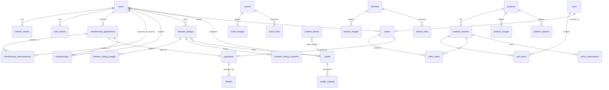

# GPCA V2 — Backend Technical Design (Database & API)

**Status:** Draft for review
**Scope:** PostgreSQL schema and HTTP API for the club site rewrite. UI/frontend is explicitly out of scope.
**Last updated:** 2026-09-04

---

## 1. Overview

This document specifies the data model and API for a full-stack replacement of the club's
existing website. It covers authentication, membership applications, the breeder directory,
events, activities, editable page content, and a merchandise store with payments.

### 1.1 Goals

- One backend serving a public, unauthenticated read surface and an authenticated write surface.
- Members maintain their own breeder listings with a draft → publish flow, without admin review.
- Admins edit page content in place, within page structures that are fixed in code.
- A merchandise store with product variants, stock tracking, a cart, and card payments.
- Membership applications that combine a fee, two member endorsements, and an admin decision.

### 1.2 Non-goals (v1)

- No frontend, theming, or component design.
- No event registration, entry fees, or attendance tracking — events are content only.
- No recurring dues, renewals, or membership expiry — membership is a one-time fee.
- No admin-authored page *types*. New structures require a code change and a migration.
- No i18n/multi-locale content, no multi-tenancy, no public API for third parties.

### 1.3 Requirements this design encodes

These came out of scoping and drive most of the decisions below:

| Area | Decision |
| --- | --- |
| Roles | `viewer` < `member` < `admin`, single role per user |
| Signup | Free and open; new accounts are `viewer` |
| Membership | Paid application + 2 member endorsements + admin approval → promoted to `member`. One-time fee, no expiry |
| "Sponsor" | A *member endorsing an applicant*, not a paid advertiser tier |
| Breeder listings | Created blank by an admin and assigned to a member; that member fills it out and self-publishes |
| Events / activities | Admin-authored listings; events filter by location, both search by keyword |
| Store | Variants (size/color), stock counts, cart, shipping address, order lifecycle |
| Content editing | Named sections inside page structures defined in code |
| Media | S3-compatible object storage |
| Auth | JWT access token + rotating refresh token |
| Visibility | Everything readable anonymously; auth required only to buy or edit |

---

## 2. Stack and topology

| Layer | Choice | Notes |
| --- | --- | --- |
| Language | Python 3.14 | `uuid.uuid7()` is in the standard library from this version |
| Web framework | Flask 3 (app factory + blueprints) | |
| Request/response models | Pydantic v2 | Validation at the edge, never trusted from the ORM inward |
| ORM | SQLAlchemy 2.0 (`Mapped[]` declarative) | |
| Migrations | Alembic | |
| Database | PostgreSQL 16 | Extensions: `pgcrypto`, `citext`, `pg_trgm`, `unaccent` |
| Object storage | S3-compatible (MinIO in dev, S3/R2/Spaces in prod) | |
| Payments | Stripe (Checkout Sessions + webhooks) | See §9 |
| Email | AWS SES (`boto3`) | Transactional only, sent inline. No queue, broker or worker; see §11 |
| Server | Gunicorn (sync workers) behind nginx | |
| Packaging | Docker + Docker Compose | Everything under `infra/` |
| Repository | Monorepo: `ui/`, `api/`, `db/`, `infra/`, `docs/` | See §2.3 and §12 |

### 2.1 Why these, briefly

**Pydantic at the boundary, SQLAlchemy inside.** Request bodies parse into Pydantic models before
touching a service function; services take and return ORM objects; response models are separate
Pydantic classes built with `model_config = ConfigDict(from_attributes=True)`. Request and response
models are never the same class — a `BreederListingUpdate` must not accept `id`, `owner_user_id`,
or `status`.

**Validation and OpenAPI — decided.** Pydantic is the validation library, with **SpecTree** supplying
the Flask glue: `@api_spec.validate(json=..., query=..., resp=...)` over ordinary blueprints, and an
OpenAPI document generated from the same models, served at `/api/v1/openapi.json`.

Marshmallow with `flask-smorest` was the serious alternative and is the more Flask-native ecosystem —
same maintainers as Flask's extension family, OpenAPI and Swagger UI included. It lost on one point:
`Schema().load()` returns a plain `dict`, so the typed request object that §2.3 depends on would have
to be rebuilt with `@post_load` hooks, and mypy would have nothing to check request handling against.

SpecTree was chosen over hand-rolling the decorator (~150 lines to own and keep in step with the
OpenAPI spec) and over `flask-openapi3`, which replaces the Flask application class rather than
layering onto normal routing.

Two integrations are needed to make it fit this design, both in `api/app/validation.py`:

- A `before` hook converts SpecTree's validation failure into `ValidationFailed`, so validation is
  not the one error in the API that is not RFC 9457 problem+json (§3.4).
- A naming strategy drops SpecTree's hash suffix (`ListingCreate.9a68e01`), which would otherwise
  reach generated clients as a class name. The cost is that schema class names must be unique
  project-wide.

**Services layer.** Blueprints stay thin: parse → call service → serialize. Business rules
(application state machine, publishing, stock decrements) live in `api/app/services/` so they are
testable without a request context and reusable from CLI commands and jobs. Persistence — the
SQLAlchemy models and every query that touches them — lives in a separate `db/` package that the
service layer imports. §2.3 defines that boundary; §12 lays out the directories.

### 2.2 Runtime containers

```
nginx  →  api (gunicorn/flask)  →  postgres
                                 └→ s3 / minio
```

That is the whole runtime. No broker, no worker, no scheduler — §11 covers why, and what would have
to change for that to stop being true.

### 2.3 Layer boundaries and model separation

The repository is a monorepo of four code layers plus docs. Dependencies point in one direction
only — a lower layer never imports a higher one:

```
ui/       browser client                        (no Python)
   ↓ HTTP
api/      Flask routes · Pydantic schemas · services · integrations · jobs
   ↓ imports
db/       SQLAlchemy models · enums · repositories · Alembic migrations
   ↓
infra/    Dockerfiles, compose, nginx, deploy config      (no application code)
```

**`db/` knows nothing about the web.** It imports SQLAlchemy and the standard library. It must
never import Flask, Pydantic, `stripe`, `boto3`, or anything from `api/`. A lint rule
(`ruff` `flake8-tidy-imports` `banned-api`) enforces this in CI, because this boundary erodes the
moment someone adds "just one" `pydantic` import for convenience.

**Two model families, never one.** SQLAlchemy models are persistence types; Pydantic models are
wire types. They are defined in different packages, and there is no base class, mixin, or generator
shared between them. That duplication is the point: a column rename must not silently change the
public API, and an API field must not force a schema change.

The path of a single request:

```
JSON body ─▶ ProductCreate            (api/app/schemas — request model, strict, extra="forbid")
          ─▶ service function          (api/app/services — business rules, transaction boundary)
          ─▶ repository call           (db/…/repositories — the only place queries are written)
          ─▶ Product                   (db/…/models — SQLAlchemy ORM object)
          ─▶ ProductRead.model_validate(obj)   (api/app/schemas — response model, from_attributes)
          ─▶ JSON response
```

Rules that make this hold up in practice:

1. **Request and response models are distinct classes.** `BreederListingUpdate` has no `id`,
   `owner_user_id`, `status`, or `published_at` — fields a client must not be able to set are
   absent from the request type, so mass assignment is impossible by construction rather than by
   a filter someone might forget.
2. **Request models are strict:** `model_config = ConfigDict(extra="forbid", strict=True,
   str_strip_whitespace=True)`. A typo'd field is a 422, not a silently ignored key.
3. **ORM objects never leave the route function.** They are converted to a response model inside
   the request's session scope. They are never returned from a route, cached, put on `g`, or
   captured for a later operation — anything deferred carries ids and re-loads.
4. **Queries live only in `db/…/repositories/`.** Services call
   `breeder_repo.get_published_by_slug(session, slug)`, not `session.execute(select(...))`. This is
   what makes the eager-loading rule below enforceable in one place instead of scattered across
   forty route handlers.
5. **Conversion is explicit.** `ProductRead.model_validate(obj)` at the boundary, never a generic
   `to_dict()` on the ORM model, and never `jsonify(orm_object)`.

---

## 3. Cross-cutting conventions

### 3.1 Identifiers

- Primary keys are `UUID` (v7, generated in Python via `uuid.uuid7()` for index locality).
  v7 keeps B-tree inserts sequential, avoiding the page-split behaviour of v4.
- Public URLs use `slug` (`citext`, unique) for content entities: breeder listings, events,
  activities, products. Slugs are generated from the name and are stable once published; changing a
  published slug writes a row to `slug_redirects`.
- Orders additionally carry a human-facing `order_number` (`GPCA-2026-000412`) from a Postgres
  sequence, for support conversations.

### 3.2 Timestamps and money

- All timestamps are `TIMESTAMPTZ`, stored UTC, serialized as RFC 3339 (`2026-09-04T17:48:00Z`).
- Every table has `created_at` and `updated_at` (`server_default=now()`, `onupdate=now()`).
- Money is `INTEGER` minor units (`price_cents`) plus a `CHAR(3)` ISO-4217 `currency`. Never float.
- Country is `CHAR(2)` ISO-3166-1 alpha-2. `state_province` is free text with a normalized
  `state_code` for US/CA so filtering is exact.

### 3.3 Response envelope and pagination

Single resources return the object directly. Collections return:

```json
{
  "data": [ ... ],
  "meta": { "page": 1, "per_page": 24, "total": 137, "total_pages": 6 }
}
```

Both shapes are built by helpers in `api/app/responses.py`, the success-side
counterpart to the error handlers in §3.4: `ok()`, `created()` (which sets `Location`),
`no_content()` and `respond()` for an explicit status. They take a Pydantic response model
rather than a dict, so a route cannot invent a payload that never reaches the OpenAPI
document. The envelope is the generic `Page[T]`, whose `Page.of()` derives `total_pages`
rather than accepting it, so the count can never disagree with the data.

- Query params: `page` (1-based), `per_page` (default 24, max 100), `sort` (`-created_at`).
- Offset pagination is fine at this data scale (hundreds of listings, not millions).

### 3.4 Errors

RFC 9457 `application/problem+json`:

```json
{
  "type": "https://api.gpca.org/errors/validation-error",
  "title": "Validation error",
  "status": 422,
  "detail": "1 field failed validation",
  "errors": [{ "field": "contact_email", "code": "value_error", "message": "not a valid email" }]
}
```

A single `@app.errorhandler` maps `AppError` subclasses (`NotFound`, `Forbidden`, `Conflict`,
`ValidationFailed`, `PaymentFailed`) to status codes. Pydantic `ValidationError` maps to 422.
Unhandled exceptions log with a request id and return a generic 500 body.

### 3.5 Versioning, headers, misc

- All routes under `/api/v1`. Breaking changes get `/api/v2`; additive changes do not.
- Every response carries `X-Request-ID` (echoed from the client or generated), logged with it.
- Mutating store endpoints accept `Idempotency-Key`; see §9.4.
- CORS is restricted to the configured frontend origin(s).
- Rate limits (Flask-Limiter, in-memory storage): 5/min on login and password reset, 20/min on
  registration and media presign, 100/min default on authenticated writes.
  In-memory storage means the counters are per gunicorn worker, so the effective limit is roughly
  the configured value times the worker count. That is fine for slowing credential stuffing on a
  club site and is not a precise quota; a shared store is the upgrade if it ever needs to be exact.

---

## 4. Authentication and authorization

### 4.1 Tokens

| Token | Form | Lifetime | Storage |
| --- | --- | --- | --- |
| Access | JWT, HS256, `sub`/`role`/`jti`/`exp` | 15 min | Client memory |
| Refresh | Opaque 256-bit random, SHA-256 hashed at rest | 30 days | `refresh_tokens` row |

- Refresh tokens **rotate**: `POST /auth/refresh` revokes the presented token and issues a new one,
  recording `replaced_by_id`. If a token that is already revoked is presented, the entire token
  family is revoked — that is the standard reuse-detection signal for a stolen token.
- Refresh tokens are returned in the JSON body (mobile/SPA friendly) and may additionally be set as
  an `HttpOnly; Secure; SameSite=Lax` cookie scoped to `/api/v1/auth`. The frontend picks one.
- The access token embeds `role` so most requests need no user lookup. Because a role change would
  otherwise take up to 15 minutes to take effect, a role change or account suspension revokes all of
  that user's refresh tokens and bumps `users.token_version`; `token_version` is a JWT claim and is
  compared against the column on every authenticated request. That is one indexed primary-key lookup
  per request — the kind of thing a cache exists to avoid at scale, and not worth a cache here.
- Passwords: Argon2id (`argon2-cffi`), parameters in config. Never logged, never returned.

### 4.2 Roles

`viewer` (default on signup) < `member` < `admin`. Single `role` column, ordered comparison —
sufficient given there are no cross-cutting permissions like "may publish a listing but is not a
member". Per-object permission comes from **ownership**, not from extra roles.

Decorators: `@require_auth`, `@require_role(Role.MEMBER)`, `@require_admin`, plus
`@require_owner_or_admin(loader)` for object-scoped checks.

### 4.3 Authorization matrix

| Resource | Anonymous | viewer | member | admin |
| --- | --- | --- | --- | --- |
| Published listings/events/activities/pages/products | read | read | read | read + write |
| Own user profile | – | read/write | read/write | read/write |
| Other users' profiles | – | – | member directory (name, city, listing) | full |
| Membership application | – | create own | read own | read all, approve/reject |
| Endorsement request | – | – | accept/decline own | read all |
| Breeder listing draft | – | – | read/write/publish **if owner** | all |
| Breeder listing create/assign owner/archive | – | – | – | yes |
| Events, activities, page content | – | – | – | create/edit/publish |
| Products, variants, stock | – | – | – | full |
| Cart & checkout | yes (guest cart) | yes | yes | yes |
| Own orders | via order token + email | read own | read own | read all, fulfil, refund |
| Media upload | – | own avatar only | own listing media | any |

Guest checkout is supported: a cart is identified by an opaque `cart_token` cookie when there is no
user. Order lookup for guests is `GET /orders/lookup?order_number=&email=` returning a signed,
short-lived view token, so an order id alone is not enough to read an order.

### 4.4 Account lifecycle

`register` → email verification token (24 h, single use) → `email_verified_at` set. Unverified
accounts may browse and buy merch but may **not** submit a membership application, endorse an
applicant, or edit a listing. Password reset uses the same single-use token table with a 1 h TTL,
and revokes all refresh tokens on success. Both endpoints return 202 regardless of whether the email
exists, to avoid account enumeration.

---

## 5. Data model

### 5.1 Entity relationships — target design, not the built schema

> **This diagram is the intended schema.** Most of it is not implemented yet.
> For what the migrations have actually built, see
> [`docs/schema.dbml`](schema.dbml) — generated from the models, verified by
> CI, and pasteable into [dbdiagram.io](https://dbdiagram.io).




### 5.2 Enumerations

Enums are PostgreSQL native `ENUM` types (created and altered via Alembic) mirrored by Python
`enum.StrEnum`. Native enums give database-level validation; the cost is that adding a value needs a
migration, which is acceptable for these fixed vocabularies.

| Type | Values |
| --- | --- |
| `user_role` | `viewer`, `member`, `admin` |
| `user_status` | `active`, `suspended` — removal is `users.deleted_at`, not a status |
| `application_status` | `draft`, `submitted`, `ready_for_review`, `approved`, `rejected`, `withdrawn` |
| `endorsement_status` | `pending`, `accepted`, `declined`, `canceled` |
| `publication_status` | `draft`, `published` — withdrawal is `archived_at`, not a status |
| `media_status` | `pending`, `ready`, `failed` |
| `payment_purpose` | `membership_application`, `merch_order` |
| `payment_status` | `requires_payment`, `processing`, `succeeded`, `failed`, `canceled`, `refunded`, `partially_refunded` |
| `order_status` | `pending_payment`, `paid`, `fulfilled`, `canceled`, `refunded`, `partially_refunded` |
| `cart_status` | `active`, `converted`, `abandoned` |
| `content_block_type` | `text`, `rich_text`, `image`, `link`, `list` |

**Live state and withdrawal are separate axes.** An enum says what a row is
*while it exists*; a nullable timestamp says whether and when it was withdrawn:

| Entity | Enum (live state) | Withdrawal |
| --- | --- | --- |
| `users` | `active`, `suspended` | `deleted_at` |
| Listings, events, activities, products | `draft`, `published` | `archived_at` (+ `archived_reason` on listings) |

Collapsing these into one enum would put the same fact in two places — a
`status = 'archived'` beside an `archived_at` column, with nothing keeping them
in agreement. Splitting them also lets a *draft* be archived, which a
three-value enum cannot express, and gives every withdrawal a time, which is
what a retention or purge pass queries on, whenever one is run.

Two consequences that must not be forgotten:

- **Public reads filter on both:** `status = 'published' AND archived_at IS NULL`.
  That pairing lives in the repository loaders (§12.2), not in routes, so no
  endpoint can apply half of it.
- **Uniqueness becomes partial where reuse should be allowed.** `users.email` is
  unique `WHERE deleted_at IS NULL`, so a deleted account does not permanently
  reserve its address. Slugs stay globally unique, because an archived listing
  is expected to come back and must keep its URL.

### 5.3 Identity and auth tables

**`users`**

| Column | Type | Notes |
| --- | --- | --- |
| `id` | `uuid` PK | |
| `email` | `citext` | `UNIQUE`, case-insensitive |
| `password_hash` | `text` | Argon2id |
| `first_name`, `last_name` | `text` | |
| `display_name` | `text NULL` | Falls back to `first_name last_name` |
| `role` | `user_role` | default `viewer` |
| `status` | `user_status` | default `active`; `active` or `suspended` only |
| `deleted_at` | `timestamptz NULL` | Set on account deletion; excluded from every read |
| `token_version` | `int` | default 0, bumped to invalidate live access tokens |
| `email_verified_at` | `timestamptz NULL` | |
| `phone` | `text NULL` | E.164 |
| `city`, `state_province`, `state_code`, `country_code` | | Shown in the member directory |
| `avatar_media_id` | `uuid NULL → media` | |
| `member_since` | `date NULL` | Denormalized from the active `memberships` row |
| `last_login_at` | `timestamptz NULL` | |
| `created_at`, `updated_at` | | |

Indexes: `UNIQUE(email) WHERE deleted_at IS NULL`; `(role) WHERE status = 'active' AND deleted_at IS NULL`; GIN trigram on
`(first_name || ' ' || last_name)` for the sponsor picker.

**`refresh_tokens`** — `id`, `user_id`, `token_hash` (`bytea`, unique), `family_id uuid`,
`issued_at`, `expires_at`, `revoked_at NULL`, `replaced_by_id NULL`, `user_agent`, `ip inet`.
Index `(user_id, revoked_at)`. Expired rows are rejected by their `expires_at`; deleting them is
housekeeping (`flask maintenance prune-tokens`, §11.2), not correctness.

**`auth_tokens`** — one table for email verification and password reset: `id`, `user_id`,
`purpose` (`email_verify` | `password_reset`), `token_hash`, `expires_at`, `consumed_at NULL`.
Partial unique index on `(user_id, purpose) WHERE consumed_at IS NULL` so a new request invalidates
the outstanding one.

**`app_settings`** — admin-editable configuration that must change without a deploy, one row per
key: `key text PK`, `value jsonb`, `value_type` (`int` | `string` | `bool` | `money` | `json`),
`label`, `description`, `updated_by_user_id`, `updated_at`. Seeded by migration from a code-side
registry (`SETTING_DEFS`) that declares each key's type, validation and default, so an admin can
change a value but not invent a key — the same containment idea as the page-block registry (§5.8).

Initial keys: `membership.fee_cents`, `membership.currency`,
`membership.required_endorsements` (default 2), `store.currency`,
`store.reservation_ttl_minutes`, `site.contact_email`.

Reads go through a typed accessor (`settings.get_int("membership.fee_cents")`) that queries the
table. It is a single-row primary-key lookup on a table of a dozen rows, which PostgreSQL serves
from shared buffers; caching it would trade correctness-after-write for nothing measurable. Every
write records an `audit_log` row with the previous and new value — a fee change is exactly the kind of thing that gets questioned six months
later.

**`audit_log`** — every privileged action: `id`, `actor_user_id`, `action` (`membership.approved`,
`listing.owner_changed`, `order.refunded`, `user.role_changed`), `object_type`, `object_id`,
`changes jsonb`, `ip inet`, `created_at`. Written by a service helper, never by the ORM directly.
Index `(object_type, object_id, created_at DESC)` and `(actor_user_id, created_at DESC)`.

### 5.4 Membership

The flow: a free `viewer` account submits an application, pays the fee, and nominates **two existing
members** as sponsors. When the payment has succeeded *and* both endorsements are accepted, the
application becomes `ready_for_review`; an admin then approves or rejects. Approval grants the
`member` role.

**`membership_applications`** — the form fields are real typed columns, not a `jsonb` blob. The
question set is fixed and short, admins need to filter and export on it, and `18 or older` and
`AKC good standing` are attestations worth having as first-class `boolean NOT NULL` columns rather
than keys that might be absent.

| Column | Type | Notes |
| --- | --- | --- |
| `id` | `uuid` PK | |
| `applicant_user_id` | `uuid → users` | |
| `status` | `application_status` | default `draft` |
| **Applicant details** | | |
| `first_name`, `last_name` | `text` | Copied from the account but independently editable |
| `email` | `citext` | Contact address for the application; may differ from the login email |
| `phone` | `text` | E.164 |
| `address_line1` | `text` | |
| `address_line2` | `text NULL` | |
| `city`, `state_province`, `state_code`, `postal_code`, `country_code` | | |
| `occupation` | `text NULL` | |
| `kennel_name` | `text NULL` | Optional — not every applicant breeds |
| `website_url` | `text NULL` | Validated as `http(s)` |
| **Attestations** | | |
| `is_18_or_older` | `boolean NOT NULL` | `CHECK` on submit, not on insert (see below) |
| `akc_good_standing` | `boolean NOT NULL` | Applicant attests to good standing with the AKC |
| `attested_at` | `timestamptz NULL` | When the applicant checked both boxes |
| **Payment** | | |
| `fee_cents`, `currency` | `int`, `char(3)` | Snapshot of `membership.fee_cents` at submission |
| `payment_id` | `uuid NULL → payments` | |
| **Workflow** | | |
| `submitted_at`, `ready_at` | `timestamptz NULL` | |
| `decided_at`, `decided_by_user_id` | | |
| `decision_note` | `text NULL` | Shown to the applicant on rejection |
| `internal_note` | `text NULL` | Admin-only |
| `form_version` | `int` | Which revision of the form this was captured against |
| `created_at`, `updated_at` | | |

Constraints:
- Partial unique index `(applicant_user_id) WHERE status IN ('draft','submitted','ready_for_review')`
  — at most one open application per user.
- `CHECK (status = 'draft' OR (is_18_or_older AND akc_good_standing))` — both attestations are
  required to leave `draft`, but a half-filled draft can still be saved.
- `CHECK (status <> 'approved' OR payment_id IS NOT NULL)`.
- The applicant must be `email_verified` and must not already be a `member` (service check).

`form_version` exists so that when the form changes, older applications are still interpretable —
a new required field is added as nullable, backfilled where possible, and validated only for
`form_version >= n` in the service. Typed columns plus a version integer gets the auditability of a
form snapshot without the query pain of `jsonb`.

**Payment.** Checkout is online only — Stripe Checkout (§9.1). The paper form's "payment options
and info" section has no database counterpart: **no payment instrument details are ever stored**,
and the fee amount comes from `app_settings` rather than from anything the applicant supplies. The
application's payment state is entirely `payment_id → payments.status`.

**`membership_endorsements`**

| Column | Type | Notes |
| --- | --- | --- |
| `id` | `uuid` PK | |
| `application_id` | `uuid → membership_applications` `ON DELETE CASCADE` | |
| `sponsor_user_id` | `uuid → users` | Must have `role = 'member'` at nomination time |
| `status` | `endorsement_status` | default `pending` |
| `invited_at`, `responded_at` | | |
| `note` | `text NULL` | Optional comment from the sponsor |
| `token_hash` | `bytea NULL` | Enables a one-click email response link |

Constraints: `UNIQUE(application_id, sponsor_user_id)`;
`CHECK (sponsor_user_id <> applicant_user_id)` enforced in the service (the applicant column lives on
the parent row); exactly two non-`canceled` endorsements required to submit — enforced in the
service, plus a partial unique index on `(application_id, slot)` where `slot IN (1,2)` to make the
"two sponsors" rule structural rather than only procedural.

If a sponsor declines, the application stays `submitted` and the applicant may cancel that
endorsement and nominate a replacement. Declines are kept, not deleted, so admins see the history.

**`memberships`** — the audit trail behind `users.role`:
`id`, `user_id`, `application_id NULL`, `granted_at`, `granted_by_user_id`,
`revoked_at NULL`, `revoked_by_user_id NULL`, `revoke_reason NULL`, `source` (`application` |
`admin_grant` | `import`). Partial unique index on `(user_id) WHERE revoked_at IS NULL`.

There is deliberately no expiry column. If annual dues are introduced later, this table already has
the right shape to gain `starts_on`/`ends_on` without restructuring.

**Revocation cascades to listings.** Revoking a membership (or suspending the user) demotes the
account to `viewer` **and archives every breeder listing they own** in the same transaction:
`archived_at = now()`, `archived_reason = 'membership_revoked'`, leaving `status` untouched at
`published` so a restore does not have to guess what it was. The listing leaves
the public directory immediately but is not deleted, and ownership is preserved — a re-granted
membership calls `restore_listings_for(user)`, which clears `archived_at` on listings archived for
that reason, leaving ones an admin archived by hand alone. Both directions write `audit_log` rows.

**Rejections and refunds.** Rejecting an application does not automatically refund. The admin
rejection endpoint takes `refund: true|false`; when true it issues a full refund through the payment
service (§9.5) in the same transaction boundary as the status change.

### 5.5 Breeder directory

An admin creates an empty listing and assigns it to a member. That member edits it and publishes on
their own schedule — no review queue. Admins retain full edit rights.

**`breeder_listings`** — the row holds the **published** state, so public reads, filters and search
are ordinary SQL. Unpublished edits live in `draft_content`.

| Column | Type | Notes |
| --- | --- | --- |
| `id` | `uuid` PK | |
| `slug` | `citext` | `UNIQUE`, assigned at first publish |
| `owner_user_id` | `uuid NULL → users` | `ON DELETE SET NULL`; null = unassigned |
| `status` | `publication_status` | `draft` until first publish; never `archived` — see `archived_at` |
| `name` | `text` | Kennel/program name |
| `logo_media_id` | `uuid NULL → media` | |
| `description` | `text NULL` | Sanitized HTML (§5.10) |
| `contact_name` | `text NULL` | |
| `contact_email` | `citext NULL` | |
| `contact_phone` | `text NULL` | |
| `city`, `state_province`, `state_code`, `country_code` | | |
| `website_url` | `text NULL` | |
| `facebook_url`, `x_url`, `linkedin_url`, `whatsapp_url` | `text NULL` | Fixed set per the feature list |
| `draft_content` | `jsonb NULL` | Pending edits; `NULL` = no unpublished changes |
| `draft_updated_at`, `draft_updated_by` | | |
| `published_at`, `last_published_by` | | |
| `archived_at` | `timestamptz NULL` | Non-null = withdrawn from the directory, whatever `status` says |
| `archived_reason` | `text NULL` | `membership_revoked` \| `admin` \| `owner_request` — drives auto-restore (§5.4) |
| `search_vector` | `tsvector` GENERATED | See §7 |
| `created_at`, `updated_at`, `created_by_user_id` | | |

Indexes:
- `UNIQUE(slug)`
- `(country_code, state_code) WHERE status = 'published' AND archived_at IS NULL` — the location filter
- GIN on `search_vector`
- GIN trigram on `name`
- `(owner_user_id)`
- `(status, name)` for the default listing order

**`breeder_listing_images`** — `id`, `listing_id` (cascade), `media_id`, `caption NULL`,
`sort_order int`, `created_at`. `UNIQUE(listing_id, media_id)`, index `(listing_id, sort_order)`.
This table is the **published** gallery; a pending gallery change is an ordered array of media ids
inside `draft_content.gallery`, reconciled against this table on publish.

**`breeder_listing_revisions`** — `id`, `listing_id` (cascade), `revision_no int`,
`content jsonb` (full published snapshot including gallery), `published_by_user_id`,
`published_at`. `UNIQUE(listing_id, revision_no)`. Append-only; supports "what changed" and a
rollback endpoint for admins.

### 5.6 Events

Admin-authored, filterable by location and searchable by keyword. No registration.

**`events`** — `id`, `slug` (unique), `title`, `summary text NULL`, `description text NULL`
(sanitized HTML), `event_type` (`show` | `trial` | `match` | `seminar` | `meeting` | `other`),
`starts_at timestamptz`, `ends_at timestamptz NULL`, `is_all_day bool`, `timezone text`
(IANA, e.g. `America/Chicago`), `venue_name`, `address_line1/2`, `city`, `state_province`,
`state_code`, `country_code`, `postal_code`, `latitude/longitude numeric NULL`,
`hero_media_id NULL`, `status publication_status`, `published_at`, `archived_at NULL`, `search_vector`,
`created_by_user_id`, `updated_by_user_id`, timestamps.

`timezone` is stored alongside the UTC instants because "9 a.m. at the show site" must render
correctly regardless of the viewer's location — `timestamptz` alone loses the intended local wall
clock. `CHECK (ends_at IS NULL OR ends_at >= starts_at)`.

Indexes: `UNIQUE(slug)`; `(starts_at) WHERE status='published' AND archived_at IS NULL` (upcoming
feed); `(country_code, state_code, starts_at) WHERE status='published' AND archived_at IS NULL`;
GIN on `search_vector`.

**`event_images`** — `id`, `event_id` (cascade), `media_id`, `caption`, `sort_order`.
**`event_links`** — `id`, `event_id` (cascade), `label`, `url`, `sort_order`, `link_type NULL`
(`premium_list` | `entry_form` | `results` | `venue` | `other`).

### 5.7 Activities

General dog sports/activities: keyword search only, no location.

**`activities`** — `id`, `slug` (unique), `name`, `summary NULL`, `description NULL`,
`hero_media_id NULL`, `status`, `published_at`, `sort_order int` (for a curated order),
`search_vector`, audit columns, plus **optional** location: `city NULL`, `state_province NULL`,
`state_code NULL`, `country_code NULL`. The columns and the `(country_code, state_code)` partial
index match the events table so a location filter can be switched on later without a migration;
`GET /activities` accepts `state`/`country` and simply matches nothing when the fields are unset.
**`activity_images`**, **`activity_links`** — same shape as their event counterparts.

> **Note on the repeated image/link tables.** A single polymorphic `attachments(owner_type,
> owner_id)` table would collapse five small tables into two, at the cost of losing real foreign
> keys and cascade deletes. Separate tables keep referential integrity in the database. The
> duplication is absorbed with SQLAlchemy mixins (`ImageCollectionMixin`, `LinkCollectionMixin`) and
> a generic service helper, so the Python cost is close to zero.

### 5.8 Editable page content

Page **types** and their sections are declared in code — an admin edits the sections of a page, but
cannot invent a page structure. A registry like:

```python
PAGE_SCHEMAS = {
    "home": PageSchema(blocks=[
        BlockDef("hero.headline",  ContentBlockType.TEXT,      max_length=120),
        BlockDef("hero.image",     ContentBlockType.IMAGE),
        BlockDef("intro.body",     ContentBlockType.RICH_TEXT),
        BlockDef("cta.link",       ContentBlockType.LINK),
    ]),
    "about": PageSchema(blocks=[...]),
}
```

is the source of truth. A startup check (and an Alembic data migration) upserts missing rows and
flags orphaned ones; a `PATCH` to an unknown `page_key`/`block_key` is a 404, not an insert.

**`content_blocks`**

| Column | Type | Notes |
| --- | --- | --- |
| `id` | `uuid` PK | |
| `page_key` | `text` | `home`, `about`, `join` |
| `block_key` | `text` | `hero.headline` |
| `block_type` | `content_block_type` | Must match the code registry |
| `value` | `jsonb NULL` | Published value, shape determined by `block_type` |
| `draft_value` | `jsonb NULL` | Pending edit; `NULL` = nothing pending |
| `media_id` | `uuid NULL → media` | Denormalized from `value` for image blocks, so media in use is queryable and not garbage-collected |
| `published_at`, `updated_by_user_id` | | |

`UNIQUE(page_key, block_key)`. Value shapes: `text` → `{"text": "..."}`; `rich_text` →
`{"html": "..."}`; `image` → `{"media_id": "...", "alt": "..."}`; `link` →
`{"label": "...", "url": "..."}`; `list` → `{"items": [...]}`. Each shape is a Pydantic
discriminated union keyed on `block_type`, so a bad payload is a 422 rather than a corrupt row.

Publishing is per page: `POST /admin/pages/{page_key}/publish` promotes every `draft_value` on that
page in one transaction, so a page never goes live half-edited.

### 5.9 Media

**`media`** — `id`, `storage_key text UNIQUE`, `bucket`, `content_type`, `byte_size bigint`,
`width int NULL`, `height int NULL`, `checksum_sha256 bytea NULL`, `original_filename`,
`alt_text NULL`, `status media_status`, `uploaded_by_user_id`, `created_at`, `confirmed_at NULL`.

**`media_variants`** — `id`, `media_id` (cascade), `variant` (`thumb` | `card` | `hero`),
`storage_key`, `width`, `height`, `byte_size`, `content_type`. `UNIQUE(media_id, variant)`.
Generated asynchronously (§11); the API returns whatever variants exist plus the original.

Images referenced by published content are public-read objects served from the bucket/CDN, so read
paths need no presigning. Uploads use short-lived presigned `PUT` URLs (§8).

### 5.10 Rich text handling

`description` fields accept HTML produced by the frontend editor. The API sanitizes on write with
`nh3` (Rust `ammonia` bindings) against an allowlist of `p, br, strong, em, u, ul, ol, li, a[href
rel target], h2, h3, blockquote`, forcing `rel="nofollow noopener"` on links and stripping all
`style`, `script`, and event handlers. Sanitizing on write means the stored value is already safe
and every consumer — API, emails, exports — benefits.

### 5.11 Store

**`products`** — `id`, `slug` (unique), `name`, `summary NULL`, `description NULL`,
`status publication_status`, `archived_at NULL`, `category text NULL`, `sort_order int`, `is_member_only bool`
(default false — a hook for member-priced or member-restricted items), `search_vector`,
audit columns.

**`product_options`** — declares the option axes for a product so the UI can render pickers:
`id`, `product_id` (cascade), `name` (`Size`), `position int`, `values text[]`
(`{'S','M','L','XL'}`). `UNIQUE(product_id, name)`.

**`product_variants`**

| Column | Type | Notes |
| --- | --- | --- |
| `id` | `uuid` PK | |
| `product_id` | `uuid → products` cascade | |
| `sku` | `citext` | `UNIQUE` |
| `options` | `jsonb` | `{"Size": "L", "Color": "Navy"}` |
| `price_cents` | `int` | `CHECK (price_cents >= 0)` |
| `currency` | `char(3)` | |
| `stock_quantity` | `int` | `CHECK (stock_quantity >= 0)` |
| `weight_grams` | `int NULL` | For shipping rates |
| `is_active` | `bool` | |
| `image_media_id` | `uuid NULL → media` | Variant-specific photo |
| `position` | `int` | |

`UNIQUE(product_id, options)` prevents duplicate combinations. A `jsonb` options map plus a
`product_options` declaration is a deliberate simplification of the full
options/values/variant-values join model: a club store has two axes at most, and the join model
costs three extra tables and a four-way join on every product read. The tradeoff is that "all
variants with Size = L" needs a GIN index on `options` (`jsonb_path_ops`) rather than a foreign key,
and the consistency between `options` keys and `product_options.name` is enforced in the service
layer, not by a constraint.

**`product_images`** — `id`, `product_id` (cascade), `media_id`, `sort_order`, `alt_text NULL`.

**`carts`** — `id`, `user_id NULL → users`, `token_hash bytea NULL` (guest carts),
`status cart_status`, `currency`, `expires_at`, timestamps. Index
`(user_id) WHERE status = 'active'`. On login the guest cart merges into the user's active cart
(quantities summed, capped at available stock).

**`cart_items`** — `id`, `cart_id` (cascade), `variant_id → product_variants ON DELETE RESTRICT`,
`quantity int CHECK (quantity > 0)`, `added_at`. `UNIQUE(cart_id, variant_id)`. Prices are **not**
stored on the cart; they are resolved live so a price change is never silently honored, and the
cart response flags any item whose price changed since it was added.

**`stock_reservations`** — `id`, `variant_id`, `order_id NULL`, `cart_id NULL`, `quantity int`,
`expires_at timestamptz`, `released_at NULL`, `consumed_at NULL`. Created when a checkout session
opens (30-minute TTL), consumed when payment succeeds, released by the expiry job or on cancel.
Available stock is `stock_quantity - SUM(active reservations)`; see §9.3 for the concurrency rules.

**`orders`**

| Column | Type | Notes |
| --- | --- | --- |
| `id` | `uuid` PK | |
| `order_number` | `text UNIQUE` | `GPCA-2026-000412` from a sequence |
| `user_id` | `uuid NULL → users` | Null for guest checkout |
| `email` | `citext` | Always captured |
| `status` | `order_status` | |
| `currency` | `char(3)` | |
| `subtotal_cents`, `shipping_cents`, `tax_cents`, `discount_cents`, `total_cents` | `int` | `CHECK (total_cents = subtotal + shipping + tax - discount)` |
| `ship_to_name`, `ship_to_line1`, `ship_to_line2`, `ship_to_city`, `ship_to_state`, `ship_to_postal_code`, `ship_to_country` | `text` | Snapshot, never a FK to a mutable address |
| `phone` | `text NULL` | |
| `shipping_method` | `text NULL` | |
| `tracking_carrier`, `tracking_number`, `tracking_url` | `text NULL` | |
| `customer_note`, `internal_note` | `text NULL` | |
| `placed_at`, `paid_at`, `fulfilled_at`, `canceled_at` | `timestamptz NULL` | |
| `cart_id` | `uuid NULL` | Provenance |

Indexes: `UNIQUE(order_number)`; `(user_id, placed_at DESC)`; `(status, placed_at DESC)`;
`(email, placed_at DESC)` for guest lookup.

**`order_items`** — `id`, `order_id` (cascade), `variant_id NULL → product_variants ON DELETE SET
NULL`, and full snapshots: `product_name`, `variant_sku`, `variant_options jsonb`,
`unit_price_cents`, `quantity`, `line_total_cents`, `image_media_id NULL`. An order must remain
readable and printable years after a product is deleted, so every displayed field is copied at
purchase time.

**`payments`**

| Column | Type | Notes |
| --- | --- | --- |
| `id` | `uuid` PK | |
| `provider` | `text` | `stripe` |
| `purpose` | `payment_purpose` | |
| `order_id` | `uuid NULL → orders` | |
| `membership_application_id` | `uuid NULL → membership_applications` | |
| `provider_payment_intent_id` | `text NULL UNIQUE` | |
| `provider_checkout_session_id` | `text NULL UNIQUE` | |
| `amount_cents`, `currency` | | |
| `amount_refunded_cents` | `int` default 0 | |
| `status` | `payment_status` | |
| `failure_code`, `failure_message` | `text NULL` | |
| `provider_metadata` | `jsonb` | Trimmed provider payload — card brand/last4/receipt URL only |
| `created_at`, `updated_at` | | |

`CHECK ((purpose = 'merch_order' AND order_id IS NOT NULL AND membership_application_id IS NULL)
OR (purpose = 'membership_application' AND membership_application_id IS NOT NULL AND order_id IS
NULL))`. No card data ever touches our database or servers — Stripe-hosted Checkout keeps the
deployment in PCI SAQ-A scope.

**`refunds`** — `id`, `payment_id`, `provider_refund_id UNIQUE`, `amount_cents`, `reason`,
`status`, `created_by_user_id NULL`, `created_at`.

**`webhook_events`** — `id`, `provider`, `provider_event_id text UNIQUE`, `event_type`,
`payload jsonb`, `received_at`, `processed_at NULL`, `status` (`pending`|`processed`|`failed`|
`ignored`), `attempts int`, `error text NULL`. The unique constraint on `provider_event_id` is the
idempotency mechanism (§9.4).

**`slug_redirects`** — `id`, `entity_type`, `old_slug`, `entity_id`, `created_at`,
`UNIQUE(entity_type, old_slug)`. Keeps old links alive after a rename.

---

## 6. Draft and publish model

Two entities are drafted; the mechanics differ because the editors differ.

### 6.1 Breeder listings (owner-driven)

The listing row **is** the published state. `draft_content` is a `jsonb` overlay of pending changes,
validated on write against the same Pydantic model as the columns:

- `GET /breeders/{slug}` (public) reads the columns. No jsonb in the hot path, so location filters
  and full-text search stay indexable.
- `GET /breeders/{id}/draft` (owner/admin) returns `columns | draft_content` merged, plus
  `has_unpublished_changes` and a per-field `changed` map so the UI can highlight edits.
- `PATCH /breeders/{id}/draft` merges the partial payload into `draft_content`. It never touches the
  published columns.
- `POST /breeders/{id}/publish` applies `draft_content` onto the columns, reconciles the gallery
  against `breeder_listing_images`, appends a `breeder_listing_revisions` snapshot, sets
  `status='published'` and `published_at`, clears `draft_content` (and `archived_at`, so publishing
an archived listing restores it), and — on first publish — mints
  the slug. All in one transaction.
- `POST /breeders/{id}/discard-draft` sets `draft_content = NULL`.

Publish requires a minimum viable listing: `name`, `description`, `contact_name`, `city`,
`state_province`, `country_code`. The service returns 422 listing the missing fields rather than
publishing a skeleton into the public directory.

An unpublished listing (`status='draft'`, never published) is invisible to the public API entirely,
which is exactly the state an admin-created blank listing starts in.

### 6.2 Page content (admin-driven)

Same idea at block granularity — `value` is live, `draft_value` is pending — but publishing is
scoped to the whole page so a page never appears half-updated. Events, activities and products have
no draft overlay: admins edit them directly and control visibility with
`status` (`draft` → `published`) plus `archived_at`, which is sufficient because there is no second party
whose edits need staging.

### 6.3 Why not a revision-per-edit model

A full revision table as the write path (every edit creates an immutable version, publishing points
a `published_revision_id` at one) is more elegant and gives free history. It also makes every public
query join to a revision, pushes filterable fields into either duplication or jsonb, and complicates
the gallery. Given a directory of hundreds of listings edited a few times a year, the overlay model
is cheaper to build and to read. History is preserved where it actually matters — the snapshot at
each publish.

---

## 7. Search and filtering

### 7.1 Full-text search

Each searchable table carries a generated `tsvector` column, so it can never drift from its source:

```sql
ALTER TABLE breeder_listings ADD COLUMN search_vector tsvector
GENERATED ALWAYS AS (
    setweight(to_tsvector('english', coalesce(name, '')), 'A') ||
    setweight(to_tsvector('english', coalesce(contact_name, '')), 'B') ||
    setweight(to_tsvector('english', coalesce(city, '') || ' ' || coalesce(state_province, '')), 'B') ||
    setweight(to_tsvector('english', coalesce(description, '')), 'C')
) STORED;

CREATE INDEX ix_breeder_listings_search ON breeder_listings USING GIN (search_vector);
```

Queries use `websearch_to_tsquery('english', :q)`, which handles quoted phrases and `-exclusion`
from raw user input without the syntax errors `to_tsquery` throws. Results order by
`ts_rank_cd(search_vector, query) DESC, name ASC`.

`description` is HTML; the generated column indexes the tags too. Rather than a stripping function
(which cannot be `IMMUTABLE` without care), the service stores a `description_text` plain-text
column alongside the HTML at write time, and the vector uses that.

### 7.2 Fuzzy name matching

Short queries and misspellings fall through to trigram similarity:

```sql
CREATE INDEX ix_breeder_listings_name_trgm ON breeder_listings USING GIN (name gin_trgm_ops);
```

The search service runs the FTS query first; if it returns fewer than 5 rows it unions in
`similarity(name, :q) > 0.3` matches, ranked below the exact ones. This is what makes "vom
Hausberg" find "Vom Hausberg Kennels".

### 7.3 Filtering

| Endpoint | Filters |
| --- | --- |
| `GET /breeders` | `q`, `state` (code or name), `country`, `sort` (`name`, `-published_at`) |
| `GET /events` | `q`, `state`, `country`, `from`, `to`, `type`, `upcoming=true`, `sort` |
| `GET /activities` | `q`, `sort` |
| `GET /products` | `q`, `category`, `in_stock=true` |
| `GET /admin/*` | adds `status`, `owner_id`, date ranges |

Filter parsing is a shared Pydantic `QueryParams` base with `page`/`per_page`/`sort` plus
per-endpoint fields; unknown parameters are rejected (`extra="forbid"`) so a typo'd filter fails
loudly instead of silently returning everything. `state` accepts either `TX` or `Texas` and resolves
through a static US/CA subdivision table shipped in code.

---

## 8. Media pipeline

Direct-to-S3 upload keeps large file bodies off the API process entirely:

1. `POST /api/v1/media/uploads` with `{filename, content_type, byte_size}`.
   The API authorizes (role + intended use), validates the content type against an allowlist
   (`image/jpeg`, `image/png`, `image/webp`, `image/avif`) and `byte_size` (≤ 10 MB), inserts a
   `media` row with `status='pending'` and a random `storage_key`
   (`uploads/{yyyy}/{mm}/{uuid}.{ext}`), and returns a presigned `PUT` URL valid for 10 minutes.
2. The client `PUT`s the bytes straight to S3.
3. `POST /api/v1/media/{id}/complete`. The API `HEAD`s the object to confirm it exists and that the
   real size and content type match what was declared, reads image dimensions, sets `status='ready'`,
   and generates the derivatives. **The declared content type is not trusted** — the server sniffs
   magic bytes on the first 512 bytes it fetches.
4. `thumb` (400px), `card` (800px) and `hero` (1600px) WebP derivatives are written to
   `media_variants` **during that same request**.

   Resizing three sizes of a ≤10 MB image takes a second or two, and it happens on a request the
   uploader is already waiting on — their own upload — rather than on a page view. That is the whole
   reason this does not need a queue. If it ever becomes too slow, the fix is to make derivatives
   lazy (generate on first request for a size, cache in `media_variants`), which still needs no
   broker.

Responses embed media as an object, never a bare id:

```json
{
  "id": "0192...",
  "alt": "Blue merle puppy on grass",
  "width": 3000, "height": 2000,
  "url": "https://cdn.gpca.org/uploads/2026/09/0192....jpg",
  "variants": { "thumb": "...", "card": "...", "hero": "..." }
}
```

Orphan cleanup is `flask maintenance cleanup-media` (§11.2), run when convenient: it deletes
`pending` rows older than 24 h with their S3 objects, and `ready` rows older than 7 days that no
entity references. Nothing breaks while orphans sit there — they cost storage, not correctness. Reference counting is by
query across the FK columns and the `content_blocks.media_id` denormalization — which is precisely
why that column exists.

---

## 9. Payments

Stripe **Checkout Sessions** (hosted page), not a custom card form. The club never handles card
data, 3-D Secure and wallets come free, and PCI scope stays at SAQ-A. `stripe-python` on the server;
the client only ever receives a redirect URL.

### 9.1 The two flows

**Merch order** — `POST /api/v1/checkout`:
1. Validate the cart: every variant active, in stock, and priced in one currency.
2. Compute totals server-side from `product_variants.price_cents`. The client's numbers are never
   trusted; a client-supplied total is not even accepted in the request body.
3. Create `orders` (`pending_payment`) + `order_items` snapshots + `stock_reservations` in one
   transaction.
4. Create a Stripe Checkout Session with `client_reference_id = order.id`,
   `metadata.order_id`, shipping address collection, and success/cancel URLs.
5. Persist a `payments` row (`requires_payment`) and return the session URL.

**Membership fee** — `POST /api/v1/membership/applications/{id}/checkout`: the same shape without
cart, stock, or shipping. Amount comes from `app_settings['membership.fee_cents']` (§5.3),
snapshotted onto the application at submission so a later fee change never rewrites a submitted
application's amount. On success the application moves toward `ready_for_review`; it never
auto-approves.

### 9.2 Fulfilment is webhook-driven

The browser returning to the success URL is a **hint**, not proof of payment — users close tabs and
success URLs can be forged. `checkout.session.completed` /
`payment_intent.succeeded` on the webhook is the only thing that marks an order paid. The success
page polls `GET /api/v1/orders/{id}` until `status` changes, so the UI stays responsive without
trusting the redirect.

### 9.3 Stock and concurrency

Available stock is `stock_quantity - SUM(quantity)` over reservations that are neither released,
consumed, nor expired. At checkout the service takes `SELECT ... FOR UPDATE` on each variant row in
a deterministic order (sorted by `variant_id`, which avoids deadlocks between concurrent carts),
checks availability, and inserts reservations. On `payment_intent.succeeded` the webhook decrements
`stock_quantity` and marks reservations consumed. The
`CHECK (stock_quantity >= 0)` constraint is the backstop: if it ever fires, the sale is refunded and
flagged rather than allowed to oversell.

Reservations expire after 30 minutes, and **expiry is lazy**: the availability query counts only
reservations with `expires_at > now()`, so an abandoned checkout stops holding stock the moment it
lapses, with nothing having to run. That is deliberate — correctness must not depend on a scheduled
job having fired.

Clearing the dead rows and canceling their `pending_payment` orders is housekeeping, not
correctness: a `flask maintenance expire-reservations` command run when convenient (§11.2). A late-arriving webhook for a canceled order re-checks stock and, if it
can no longer be honored, refunds automatically and notifies an admin.

### 9.4 Idempotency

- **Inbound webhooks:** insert `webhook_events` keyed on `provider_event_id` first. A duplicate
  insert violates the unique constraint and the handler returns 200 immediately. Stripe retries
  aggressively; this makes retries free.
- **Outbound Stripe calls:** pass an `Idempotency-Key` derived from our own object id
  (`order:{id}:session`), so a retried checkout never creates a second session.
- **Client requests:** `POST /checkout` accepts an `Idempotency-Key` header. The key and its
  response are stored in an `idempotency_keys` table (`key`, `scope`, `response_status`,
  `response_body jsonb`, `created_at`), unique on `(scope, key)`. Rows older than 24 h are ignored on
  read and deleted by `prune-tokens` when it runs. The unique constraint is what makes a concurrent
  retry safe, which a cache with a TTL cannot guarantee.
- **Signature verification:** every webhook body is verified with
  `stripe.Webhook.construct_event` against `STRIPE_WEBHOOK_SECRET` before parsing. The raw body is
  required, so that route reads `request.get_data()`, not the parsed JSON.

Handled events: `checkout.session.completed`, `checkout.session.expired`,
`payment_intent.succeeded`, `payment_intent.payment_failed`, `charge.refunded`, `charge.dispute.created`.

### 9.5 Refunds

`POST /api/v1/admin/orders/{id}/refund` with an optional `amount_cents` (full refund by default) and
`reason`, plus `restock: true|false`. Creates the Stripe refund, writes a `refunds` row, and lets
the `charge.refunded` webhook move `payments.status` and `orders.status` to `refunded` /
`partially_refunded` — the same code path either way, so a refund issued from the Stripe dashboard
is reflected identically.

---

## 10. API reference

All paths are prefixed `/api/v1`. **Auth** column: `–` public, `U` any authenticated user,
`M` member, `A` admin, `O` owner-or-admin.

### 10.1 Auth and account

| Method | Path | Auth | Purpose |
| --- | --- | --- | --- |
| POST | `/auth/register` | – | Create a `viewer` account, send verification email |
| POST | `/auth/login` | – | Returns access + refresh tokens |
| POST | `/auth/refresh` | – | Rotate refresh token, issue new access token |
| POST | `/auth/logout` | U | Revoke the presented refresh token |
| POST | `/auth/logout-all` | U | Revoke every refresh token for the user |
| POST | `/auth/verify-email` | – | Consume verification token |
| POST | `/auth/verify-email/resend` | U | Re-send verification |
| POST | `/auth/password/forgot` | – | Always 202 |
| POST | `/auth/password/reset` | – | Consume token, revoke sessions |
| GET | `/me` | U | Current user, role, membership status, owned listing ids |
| PATCH | `/me` | U | Name, phone, location, avatar |
| POST | `/me/password` | U | Requires current password |

### 10.2 Membership

| Method | Path | Auth | Purpose |
| --- | --- | --- | --- |
| GET | `/membership/config` | – | Fee, currency, required sponsor count — read from `app_settings` |
| POST | `/membership/applications` | U | Create a draft application |
| GET | `/membership/applications/me` | U | The applicant's own application + endorsement states |
| PATCH | `/membership/applications/{id}` | O | Edit while `draft` |
| POST | `/membership/applications/{id}/sponsors` | O | Nominate a member (slot 1 or 2), emails them |
| DELETE | `/membership/applications/{id}/sponsors/{endorsement_id}` | O | Cancel a pending/declined nomination |
| POST | `/membership/applications/{id}/submit` | O | Validate completeness, move to `submitted` |
| POST | `/membership/applications/{id}/checkout` | O | Stripe session for the fee |
| POST | `/membership/applications/{id}/withdraw` | O | Applicant withdraws |
| GET | `/membership/endorsements/me` | M | Endorsement requests awaiting my response |
| POST | `/membership/endorsements/{id}/accept` | M | Accept (optional note) |
| POST | `/membership/endorsements/{id}/decline` | M | Decline (optional note) |
| GET | `/members/search?q=` | M | Sponsor picker: id, display name, city/state only |
| GET | `/admin/membership/applications` | A | Filter by `status`, search applicant |
| GET | `/admin/membership/applications/{id}` | A | Full detail incl. payment and endorsements |
| POST | `/admin/membership/applications/{id}/approve` | A | Grants `member`, writes `memberships` |
| POST | `/admin/membership/applications/{id}/reject` | A | `{reason, refund: bool}` |
| POST | `/admin/users/{id}/membership/revoke` | A | Demotes to `viewer`, archives owned listings (§5.4) |
| GET | `/admin/settings` | A | All editable settings with type, label and current value |
| PATCH | `/admin/settings` | A | `{"membership.fee_cents": 5000}` — validated against `SETTING_DEFS` |

Application state transitions:

```
draft ──submit──▶ submitted ──(payment succeeded AND 2 endorsements accepted)──▶ ready_for_review
  │                   │                                                                │
  └──withdraw──▶ withdrawn ◀──withdraw───┘                            approve ─────────┤──▶ approved
                                                                       reject ─────────┘──▶ rejected
```

`submitted → ready_for_review` is evaluated by one service function — `maybe_mark_ready(application)`
— called from both the Stripe webhook and the endorsement-accept endpoint, so the order in which
payment and endorsements arrive does not matter.

### 10.3 Breeder directory

| Method | Path | Auth | Purpose |
| --- | --- | --- | --- |
| GET | `/breeders` | – | Published listings; `q`, `state`, `country`, paging |
| GET | `/breeders/{slug}` | – | Published detail |
| GET | `/breeders/filters` | – | Facet counts by state/country for the filter UI |
| GET | `/me/breeder-listings` | M | Listings I own, with draft state |
| GET | `/breeders/{id}/draft` | O | Merged published + draft view |
| PATCH | `/breeders/{id}/draft` | O | Partial update into `draft_content` |
| POST | `/breeders/{id}/draft/gallery` | O | Append media ids |
| PUT | `/breeders/{id}/draft/gallery` | O | Replace ordered gallery |
| DELETE | `/breeders/{id}/draft/gallery/{media_id}` | O | Remove one |
| POST | `/breeders/{id}/publish` | O | Validate + publish + snapshot |
| POST | `/breeders/{id}/discard-draft` | O | Drop pending edits |
| POST | `/admin/breeders` | A | Create a blank listing, assign `owner_user_id` |
| PATCH | `/admin/breeders/{id}` | A | Change owner, status, slug |
| POST | `/admin/breeders/{id}/archive` | A | Remove from the public directory |
| GET | `/admin/breeders/{id}/revisions` | A | Publish history |
| POST | `/admin/breeders/{id}/revisions/{n}/restore` | A | Roll back to a snapshot |

### 10.4 Events and activities

| Method | Path | Auth | Purpose |
| --- | --- | --- | --- |
| GET | `/events` | – | `q`, `state`, `country`, `from`, `to`, `type`, `upcoming` |
| GET | `/events/{slug}` | – | Detail with gallery and links |
| GET | `/events/filters` | – | Facets for the filter UI |
| POST/PATCH/DELETE | `/admin/events[/{id}]` | A | CRUD |
| POST | `/admin/events/{id}/publish` \| `/archive` | A | Status transitions |
| PUT | `/admin/events/{id}/images` \| `/links` | A | Replace ordered collections |
| GET | `/activities` | – | `q`, paging |
| GET | `/activities/{slug}` | – | Detail |
| POST/PATCH/DELETE | `/admin/activities[/{id}]` | A | CRUD, same sub-resources |

### 10.5 Page content

| Method | Path | Auth | Purpose |
| --- | --- | --- | --- |
| GET | `/pages/{page_key}` | – | Published blocks, keyed by `block_key` |
| GET | `/admin/pages` | A | Page keys and their schemas |
| GET | `/admin/pages/{page_key}` | A | Published + draft values + block definitions |
| PATCH | `/admin/pages/{page_key}/blocks` | A | `{ "hero.headline": {"text": "..."} }` into drafts |
| POST | `/admin/pages/{page_key}/publish` | A | Promote all drafts on the page |
| POST | `/admin/pages/{page_key}/discard-draft` | A | Drop pending edits |

### 10.6 Store

| Method | Path | Auth | Purpose |
| --- | --- | --- | --- |
| GET | `/products` | – | Active products with price range and availability |
| GET | `/products/{slug}` | – | Detail with options, variants, images |
| GET | `/cart` | – | Current cart (session user or `cart_token` cookie) |
| POST | `/cart/items` | – | `{variant_id, quantity}`; validates availability |
| PATCH | `/cart/items/{id}` | – | Change quantity |
| DELETE | `/cart/items/{id}` | – | Remove |
| POST | `/cart/merge` | U | Merge guest cart into the account cart on login |
| POST | `/checkout` | – | Creates order + reservations, returns Stripe URL |
| GET | `/orders` | U | My orders |
| GET | `/orders/{id}` | O | Order detail (polled by the success page) |
| POST | `/orders/lookup` | – | `{order_number, email}` → short-lived guest view token |
| POST | `/webhooks/stripe` | – | Signature-verified; not part of the public contract |
| GET/POST/PATCH | `/admin/products[/{id}]` | A | CRUD |
| PUT | `/admin/products/{id}/variants` | A | Upsert the variant set |
| PATCH | `/admin/variants/{id}/stock` | A | Absolute set or `delta`, writes `audit_log` |
| GET | `/admin/orders` | A | `status`, date range, email/order-number search |
| PATCH | `/admin/orders/{id}` | A | Fulfil, tracking, internal note |
| POST | `/admin/orders/{id}/refund` | A | `{amount_cents?, reason, restock}` |
| GET | `/admin/orders/export.csv` | A | Fulfilment/accounting export |

### 10.7 Media and system

| Method | Path | Auth | Purpose |
| --- | --- | --- | --- |
| POST | `/media/uploads` | U | Presigned PUT + pending `media` row |
| POST | `/media/{id}/complete` | U | Verify object, mark ready, queue derivatives |
| PATCH | `/media/{id}` | O | Alt text / caption |
| DELETE | `/media/{id}` | O | Only if unreferenced |
| GET | `/health` | – | Liveness. **Unversioned** — infrastructure, not part of the client contract, so it does not move when `/api/v2` arrives |
| GET | `/health/ready` | – | Readiness: DB + S3 reachability. Also unversioned |
| GET | `/openapi.json` | – | Generated spec |

---

## 11. Email and housekeeping

**No queue, no outbox, no worker, no scheduler.** Email is sent inline, in the request that causes
it. Nothing in this system runs on a timer.

That is defensible here because of one property: **the database is the source of truth and email is
only a notification.** Every message this app sends has a recovery path that does not involve the
message arriving.

| Email | If it is lost |
| --- | --- |
| Address verification | The user clicks resend |
| Password reset | The user requests another |
| Endorsement request | The application shows the sponsor as `pending`; the applicant re-sends or nominates someone else |
| Application approved / rejected | The decision is on their application page |
| Order confirmation | The order is in the database and on their orders page; an admin can resend |

Nothing becomes *wrong* when an email fails — only less convenient. A queue exists to make delivery
reliable, and delivery here is not load-bearing.

### 11.1 The three rules that make inline sending safe

1. **Send after commit, never inside the transaction.** A message about an order that then rolls
   back is worse than no message.
2. **A failed send must never fail the operation.** The call is wrapped; a failure is logged at
   error level with the request id and nothing else happens. The account is still created, the
   payment is still recorded.
3. **Never send from a path that gets retried.** The Stripe webhook is the one that matters: if the
   handler raises after marking an order paid, Stripe retries and the customer gets two
   confirmations. Rule 2 already prevents that, and it is the reason rule 2 is not optional.

The cost is honest and small: a send adds roughly 100–300 ms to the request that triggers it, and a
transient SES failure means that email is simply gone. Both are acceptable for a club site.

### 11.2 Housekeeping

A few things accumulate. **None of them affect correctness**, so none of them need to run on a
schedule — they are `flask` subcommands run by hand, or from cron later if the volume ever warrants
it, alongside `flask seed dev` and `flask users create-admin`.

| Command | What accumulates without it |
| --- | --- |
| `flask maintenance prune-tokens` | Expired refresh, verification and reset rows. Already rejected by their `expires_at`, just not deleted |
| `flask maintenance expire-reservations` | Lapsed stock reservation rows. Already excluded from availability by the `expires_at` filter (§9.3) |
| `flask maintenance cleanup-media` | Orphaned uploads that were never attached to anything |

Two things deliberately absent:

- **No webhook retry job.** Stripe retries a failed webhook itself for about three days, which is
  strictly better than anything we would write.
- **No reservation sweeper as a correctness mechanism.** Expiry is lazy by design (§9.3): the
  availability query filters on `expires_at`, so stock frees itself whether or not anything runs.

### 11.3 When this stops being enough

The signals, so the decision gets revisited on evidence rather than nerves: request latency from
SES becoming visible to users, a lost email that actually costs something, or bulk sending such as
a members-wide announcement.

The upgrade path is additive and does not touch the schema or the service layer — introduce an
`outbox_emails` table, have the send helper write to it instead of calling SES, and drain it. That
is a change to one function. Deferring it costs nothing now.

### 11.4 SES specifics

`SendEmailV2` through `boto3`, not SMTP, so bounces and complaints come back as SNS notifications; a
`POST /webhooks/ses` endpoint (SNS signature-verified) records them in an `email_suppressions` table
(`email`, `type` (`bounce` | `complaint`), `reason`, `created_at`) and the send helper skips
suppressed addresses. Ignoring that feedback loop is the usual way a domain's sending reputation
dies. A configuration set with event publishing is set at the identity level; production requires
SES production access (out of the sandbox) and DKIM + SPF + a DMARC record on the sending domain,
which is a DNS task worth starting early since propagation and AWS review both take days.

Templates (Jinja, plain text + HTML): verification, password reset, endorsement request, endorsement
responded, application submitted, application approved/rejected, order confirmation, shipping
confirmation, refund issued.

---

## 12. Repository layout, models, and migrations

### 12.1 Directories

```
GPCA-V2/
├── ui/                          # frontend (out of scope for this document)
│
├── api/                         # service layer — Flask, Pydantic, business rules
│   ├── pyproject.toml           # depends on gpca-db (path dependency)
│   ├── app/
│   │   ├── __init__.py          # create_app() factory
│   │   ├── config.py            # pydantic-settings, env-driven, validated at boot
│   │   ├── extensions.py        # session factory, limiter, s3 and ses clients
│   │   ├── errors.py            # AppError hierarchy + problem+json handlers
│   │   ├── routes/v1/           # blueprints: auth, membership, breeders, events,
│   │   │                        #   activities, pages, store, media, admin, webhooks
│   │   ├── schemas/             # Pydantic ONLY — request + response models per resource
│   │   ├── services/            # business rules, transaction boundaries, state machines
│   │   ├── security/            # jwt, argon2, decorators, authorization
│   │   ├── integrations/        # stripe_client, s3_client, ses_client
│   │   ├── maintenance/         # housekeeping CLI subcommands, run by hand
│   │   ├── content/schemas.py   # PAGE_SCHEMAS registry (§5.8)
│   │   ├── settings_defs.py     # SETTING_DEFS registry (§5.3)
│   │   └── cli.py               # flask seed / users create-admin
│   └── tests/
│       ├── unit/                # services with a fake repository
│       └── integration/         # API against a real Postgres
│
├── db/                          # persistence layer — SQLAlchemy + Alembic, no web framework
│   ├── pyproject.toml           # depends on sqlalchemy, alembic, psycopg — nothing else
│   ├── alembic.ini
│   ├── migrations/
│   │   ├── env.py               # imports gpca_db.models for autogenerate metadata
│   │   └── versions/
│   └── gpca_db/
│       ├── base.py              # DeclarativeBase, naming convention, TimestampMixin
│       ├── enums.py             # StrEnum + the PG ENUM type objects
│       ├── types.py             # UUIDv7 pk, Money, CIText, TSVector helpers
│       ├── session.py           # engine + sessionmaker construction (no Flask globals)
│       ├── models/              # user, membership, breeder, event, activity,
│       │                        #   content, media, store, payment, settings, audit
│       └── repositories/        # the only place select()/insert() is written
│
├── infra/                       # no application code
│   ├── docker/                  # Dockerfile.api, Dockerfile.ui, entrypoints
│   ├── compose/                 # docker-compose.yml (dev) + .prod.yml
│   ├── nginx/
│   └── env/                     # .env.example per environment (never real secrets)
│
└── docs/
```

`api/` declares `gpca-db` as a path dependency (`{path = "../db", develop = true}`), so the
dependency direction is enforced by packaging, not convention: `db/` cannot import `api/`
because it does not depend on it and never will.

### 12.2 What `db/` holds, and what it does not

**`db/` is a persistence package, and the name is meant literally.** It is not a DDD domain layer:
there are no aggregates, no entities-independent-of-storage, no repository interfaces with
swappable implementations, and no business rules inside it. It holds the SQLAlchemy models, the
queries that load them, and the migrations that create them — nothing else. It was called
`domain/` in an earlier draft, which invited exactly the wrong expectation.

The test for where a line of code belongs:

> Does it need to know that HTTP, a logged-in user, Stripe, or an email exists? → `api/`
> Does it need to know what a table looks like? → `db/`

| Lives in `db/` | Does **not** live in `db/` |
| --- | --- |
| SQLAlchemy models: columns, relationships, constraints, indexes | Flask, Pydantic, `request`, `g`, blueprints |
| Native enum types and their Python `StrEnum` mirrors | Authorization ("is this user the owner?") |
| Query functions, with their eager-load declarations | Business rules and state machines |
| Alembic migrations and seed revisions | Stripe, SES, S3 calls |
| Engine and `sessionmaker` construction | Transaction orchestration across several operations |
| Column-level invariants (`CHECK`, `UNIQUE`, `NOT NULL`) | Anything that decides *whether* an action is allowed |

Concretely, "publish a breeder listing" splits like this:

| Step | Package |
| --- | --- |
| Parse and validate the request body | `api/app/schemas` |
| Check the caller owns the listing | `api/app/security` |
| Load the listing with its images | `db/…/repositories/breeders.py` |
| Reject if required fields are missing; merge draft; mint slug; write the revision row; commit | `api/app/services/breeders.py` |
| The `breeder_listings` and `breeder_listing_revisions` tables themselves | `db/…/models` |
| Serialize the result | `api/app/schemas` |

**Repositories are query modules, not the Repository Pattern.** There is no `Repository[T]` base
class, no interface with a fake implementation, no unit-of-work abstraction. A repository module is
a flat set of functions that take a `Session` first and return models or scalars:

```python
# db/gpca_db/repositories/breeders.py
PUBLIC_LOAD = (
    selectinload(BreederListing.logo),
    selectinload(BreederListing.images).selectinload(BreederListingImage.media),
)

def get_published_by_slug(session: Session, slug: str) -> BreederListing | None:
    stmt = (
        select(BreederListing)
        .where(BreederListing.slug == slug, BreederListing.status == PublicationStatus.PUBLISHED)
        .options(*PUBLIC_LOAD)
    )
    return session.scalars(stmt).one_or_none()
```

They exist for one reason: `lazy="raise"` (§12.4) means every access path must declare what it
loads, and `PUBLIC_LOAD` is that declaration written once instead of in every route that renders a
listing. If that ever feels like ceremony, folding these functions into the services that call them
is a change of import path and nothing else — the boundary that carries the weight is
`db/` vs `api/`, not services vs repositories.

### 12.3 How the SQLAlchemy and Pydantic models interact

The concern behind "two model families" is usually that you end up maintaining the same field list
twice. In practice these three types are not the same shape, and the gap widens as the app grows:

| | `BreederListing` (ORM) | `BreederListingRead` (public response) | `BreederListingUpdate` (owner PATCH) |
| --- | --- | --- | --- |
| Fields | ~31 columns | 10, restructured and nested | ~13, all optional |
| Includes | `draft_content`, `search_vector`, `description_text`, `archived_reason`, `owner_user_id`, audit columns | resolved image URLs, nested `contact` / `location` / `socials` objects | only what an owner may set |
| Excludes | — | everything internal | `id`, `slug`, `status`, `owner_user_id`, `published_at` |

Only about nine field *names* appear in all three, and they are the boring ones. The interesting
columns must never reach the wire, and the wire shape — nested objects, a CDN URL built from config
the database knows nothing about — cannot be produced by reading columns straight across. So the
"duplicate field list" is mostly an illusion; what looks like duplication is the API contract being
stated independently of the storage layout, which is the point.

**Three conversion cases.**

*Shape matches:* `from_attributes` does the work, no mapping code.

```python
class MembershipEndorsementRead(BaseModel):
    model_config = ConfigDict(from_attributes=True)
    id: UUID
    status: EndorsementStatus
    responded_at: datetime | None
```

*Shape differs:* an explicit classmethod on the response model. It takes anything the database
cannot supply (here, the URL builder) as an argument, which is exactly why this cannot be a
`to_dict()` on the ORM model:

```python
# api/app/schemas/breeders.py
class BreederListingRead(BaseModel):
    slug: str
    name: str
    description_html: str | None
    logo: MediaRead | None
    contact: ContactCard
    location: Location
    socials: SocialLinks
    gallery: list[MediaRead]
    published_at: datetime

    @classmethod
    def from_model(cls, m: BreederListing, urls: MediaUrlBuilder) -> "BreederListingRead":
        return cls(
            slug=m.slug,
            name=m.name,
            description_html=m.description,
            logo=urls.read(m.logo) if m.logo else None,
            contact=ContactCard(name=m.contact_name, email=m.contact_email, phone=m.contact_phone),
            location=Location(city=m.city, state=m.state_province, country=m.country_code),
            socials=SocialLinks(facebook=m.facebook_url, x=m.x_url,
                                linkedin=m.linkedin_url, whatsapp=m.whatsapp_url),
            gallery=[urls.read(i.media) for i in m.images],
            published_at=m.published_at,
        )
```

*Partial update:* the request model carries the write contract, and `exclude_unset=True` is what
distinguishes "the client did not send this field" from "the client explicitly set it to null" —
a distinction PATCH needs and a plain `dict` cannot express.

```python
class BreederListingUpdate(BaseModel):
    model_config = ConfigDict(extra="forbid", strict=True, str_strip_whitespace=True)
    name: str | None = Field(None, max_length=120)
    description_html: str | None = None
    contact_email: EmailStr | None = None
    facebook_url: HttpUrl | None = None
    # ... no id, no slug, no status, no owner_user_id
```

**The full round trip**, with each line's home package:

```python
# api/app/routes/v1/breeders.py
@bp.get("/breeders/<slug>")
@validate(response=BreederListingRead)
def get_breeder(slug: str):
    with session_scope() as session:                                  # api/extensions
        listing = breeder_repo.get_published_by_slug(session, slug)   # db/repositories
        if listing is None:
            raise NotFound("breeder listing", slug)                   # api/errors
        return BreederListingRead.from_model(listing, media_urls())   # api/schemas


@bp.patch("/breeders/<uuid:listing_id>/draft")
@require_owner_or_admin(load_listing)                                 # api/security
@validate(body=BreederListingUpdate, response=BreederListingDraftRead)
def patch_draft(listing_id: UUID, body: BreederListingUpdate):
    with session_scope() as session:
        listing = breeder_service.update_draft(                       # api/services
            session, listing_id, body.model_dump(exclude_unset=True), actor=g.user
        )
        return BreederListingDraftRead.from_model(listing, media_urls())
```

Two invariants keep this from rotting:

- **The response model and the repository loader are a pair.** `BreederListingRead` reads `.logo`
  and `.images`, so `get_published_by_slug` must load them. Because relationships are `lazy="raise"`,
  forgetting the loader raises loudly on the first call rather than quietly issuing N+1 queries — the
  route's own integration test catches it.
- **Conversion happens inside the session scope, before commit closes it.** With
  `expire_on_commit=False` and conversion inside `session_scope()`, serialization never triggers a
  refresh against a finished transaction.

**How many classes per entity.** Add a response model only when the *audience* differs, and use
inheritance when it does. For breeder listings that is three — `BreederListingRead` (public),
`BreederListingDraftRead(BreederListingRead)` adding `has_unpublished_changes` and the draft
overlay, and `BreederListingAdminRead(BreederListingDraftRead)` adding owner and audit fields —
plus one `BreederListingUpdate`. Most entities need two: a read and a write. Writing a
`FooRead`, `FooCreate`, `FooUpdate`, `FooListItem` and `FooAdminRead` for a table nobody edits is
the actual smell, and the rule against it is: no schema class without a caller that needs a
different set of fields.

**The honest alternative.** `SQLModel` collapses the two families into one class and would remove
real code. The reasons not to here: this schema leans on things SQLModel handles poorly or not at
all (generated `tsvector` columns, partial and expression indexes, native enums, `CHECK`
constraints, `lazy="raise"`); the public read shapes are genuinely different from the row shapes,
so the single class would sprout response-only computed fields and exclusion lists anyway; and a
single class makes it easy to add a column and ship it to the public API by accident. If this were
an internal CRUD tool over flat tables, the tradeoff would go the other way.

### 12.4 Strict SQLAlchemy models

`db/gpca_db/models/` holds the only ORM classes in the system. "Strict" means specific
things:

```python
class Base(DeclarativeBase):
    metadata = MetaData(naming_convention={
        "ix": "ix_%(table_name)s_%(column_0_N_name)s",
        "uq": "uq_%(table_name)s_%(column_0_N_name)s",
        "ck": "ck_%(table_name)s_%(constraint_name)s",
        "fk": "fk_%(table_name)s_%(column_0_name)s_%(referred_table_name)s",
        "pk": "pk_%(table_name)s",
    })
    type_annotation_map = {Decimal: Numeric(12, 2), dict: JSONB, datetime: TIMESTAMP(timezone=True)}


class BreederListing(Base):
    __tablename__ = "breeder_listings"

    id: Mapped[UUID] = mapped_column(primary_key=True, default=uuid7)
    slug: Mapped[str | None] = mapped_column(CIText, unique=True)
    owner_user_id: Mapped[UUID | None] = mapped_column(ForeignKey("users.id", ondelete="SET NULL"))
    status: Mapped[PublicationStatus] = mapped_column(publication_status_enum)

    owner: Mapped["User | None"] = relationship(lazy="raise", back_populates="breeder_listings")
    images: Mapped[list["BreederListingImage"]] = relationship(
        lazy="raise", order_by="BreederListingImage.sort_order", cascade="all, delete-orphan"
    )
```

- **Every attribute is `Mapped[...]`-annotated.** `__allow_unmapped__` is never set, so an
  un-annotated class attribute is an error at import time rather than a mystery at runtime.
- **`lazy="raise"` on every relationship.** Accessing an unloaded relationship raises instead of
  emitting a query. This is the single highest-value rule here: it makes N+1 queries and
  detached-instance errors impossible to introduce accidentally, and it forces every access path to
  declare what it needs via `selectinload()` in the repository.
- **Naming conventions on `MetaData`.** Every index and constraint gets a deterministic name, which
  is what lets Alembic autogenerate produce clean, reversible downgrades.
- **No serialization methods.** No `to_dict()`, no `__json__`, no Pydantic config. A model that
  knows how to serialize itself is a model the API layer will start depending on.
- **No business logic.** Models hold columns, relationships, and constraints. `approve()` belongs in
  a service; a model method that mutates related rows is a transaction boundary hiding in an object.
- **`Session` is passed in.** No global session, no `db.session` proxy — repositories take
  `session: Session` as their first argument, so tests and jobs control the transaction.
- **`expire_on_commit=False`** on the sessionmaker, and services commit *before* the route converts
  to a response model, so serialization never triggers a surprise refresh against a closed
  transaction.

### 12.5 Alembic migrations

Alembic lives in `db/` next to the models it tracks, and is the **only** way the schema
changes — no `create_all()` anywhere outside a throwaway test fixture.

- `env.py` imports `gpca_db.models` so `target_metadata = Base.metadata` sees every table, and
  reads the URL from `DATABASE_URL` rather than `alembic.ini`, so the same migrations run in dev,
  CI and prod unchanged.
- `context.configure(compare_type=True, compare_server_default=True, include_schemas=False)`.
- **Autogenerate is a draft, not an answer.** Every generated revision is read and edited before
  it is committed. Things autogenerate reliably gets wrong here: native `ENUM` changes, the
  `GENERATED ALWAYS AS ... STORED` search vectors, partial and expression indexes, and `CHECK`
  constraints — all of which this schema uses heavily.
- **Enum changes are hand-written.** `ALTER TYPE ... ADD VALUE` cannot run inside a transaction
  block on older servers and cannot be reversed, so a value addition is its own revision with a
  comment explaining the irreversibility.
- **Index creation on populated tables uses `CREATE INDEX CONCURRENTLY`** in a revision marked
  `transactional_ddl = False`, so a deploy does not lock the directory table.
- **Every revision has a real `downgrade()`**, or a comment stating why it cannot.
- **Data migrations are separate revisions** from schema migrations, and use core `table()`/`column()`
  constructs rather than importing the ORM models — a model imported into a migration silently
  becomes a time bomb the next time that model changes.
- **One head, always.** CI fails on multiple heads (`alembic heads --resolve-dependencies`) and on a
  model/migration mismatch: a job runs `alembic upgrade head` against an empty database, then
  `alembic check`, which fails if autogenerate would produce a non-empty diff. That check is what
  keeps "someone edited a model and forgot the migration" from reaching main.
- Migrations run as a one-shot container before the API rolls (§12.7), never from the app entrypoint.

Seed data ships as Alembic revisions where it is structural (`content_blocks` from `PAGE_SCHEMAS`,
`app_settings` from `SETTING_DEFS`) and as `flask seed dev` where it is only for local convenience.

### 12.6 Testing

- `pytest` + `testcontainers[postgres]` (or a compose-provided database in CI) — no SQLite.
  Generated columns, `citext`, partial indexes, native enums and `jsonb` behave differently enough
  that SQLite tests would pass while production fails.
- The schema under test is built by running **Alembic**, not `create_all()`, so migrations are
  exercised on every run.
- Each test runs in a transaction rolled back at teardown.
- `factory_boy` for fixtures; `stripe-mock` for Stripe; `moto` for S3 and SES.
- Layer-appropriate tests: services against fake repositories (fast, no database), repositories
  against real Postgres, routes end-to-end through the app.
- Coverage targets: the membership state machine (including endorsement
  ordering), the publish transaction, membership revocation archiving listings, stock concurrency
  (parallel checkouts on the last unit), and webhook idempotency (same event delivered three times).

### 12.7 Deployment

Multi-stage Dockerfiles under `infra/docker/` (build wheels → slim runtime, non-root user).
Gunicorn with `--workers $(2*CPU+1) --timeout 30`. Migrations run as a one-shot container before the
API rolls, so concurrent gunicorn workers cannot race the schema. There is no second long-running
process to supervise: `flask maintenance` is invoked by hand from the same image when needed. Config is entirely environment-driven and validated at boot by
`pydantic-settings`; the process refuses to start with a missing secret rather than failing on the
first request.

Backups: nightly `pg_dump` to object storage with a 30-day retention, plus bucket versioning on the
media bucket. Restore is rehearsed before launch, not after the first incident.

---

## 13. Security notes

- Argon2id passwords; JWT `HS256` with a secret from the environment; `token_version` for instant
  revocation (§4.1).
- All HTML sanitized on write (§5.10). Responses set `X-Content-Type-Options: nosniff`.
- Rate limits on auth, media presign, checkout, and endorsement endpoints.
- Public breeder contact emails are the listing's chosen contact address, not the owner's account
  email, and the API never exposes `users.email` to non-admins.
- Guest order access requires order number **and** email (§4.3).
- Enumeration protection on registration, login and password reset (uniform responses and timing).
- Stripe webhook signature verification; no card data stored (§9).
- Admin actions written to `audit_log` (§5.3).
- SQLAlchemy parameter binding throughout; any raw SQL uses bound parameters, never f-strings.
- Uploads: allowlisted content types, size caps, magic-byte sniffing, randomized storage keys,
  and objects served from a separate domain so a malicious file cannot execute in the app's origin.

---

## 14. Open questions

Still unresolved, in rough order of how much they block implementation:

1. **Shipping rates** — flat rate, weight-based tiers, or Stripe Checkout's own shipping options?
   `weight_grams` is in the schema either way. International shipping at all? This is the only open
   item that blocks finishing checkout.
2. **Sales tax** — Stripe Tax (automatic, per-jurisdiction) or a single home-state rate? Affects the
   totals math and the `orders` columns only.
3. **Data migration** — is there an export from the existing site (members, breeders, events) to
   import? If existing users need accounts, the plan is: create accounts with unusable password
   hashes, then send a forced password-reset email at cutover.
4. **Discount codes** — not modeled. Worth a `discounts` table in v1, or later? Adding it later is
   a `discounts` table plus one nullable `orders.discount_id` — cheap to defer.
5. **Membership fee amount** — the mechanism is settled (`app_settings`, admin-editable). What is
   the current fee and currency for the seed row?
6. **`site.contact_email`** — needed to seed `app_settings` and the email templates.

Answered since the first draft: removal is a timestamp rather than an enum value, and the project
spells it `canceled` (§5.2); checkout is online only, so the offline-payment path is gone
(§5.4); membership fee is an admin-editable DB row (§5.3); application fields are typed columns
(§5.4); revoked memberships archive owned listings (§5.4); email is AWS SES (§11); activities carry
optional location (§5.7).

## 15. Decision log

| Decision | Alternative considered | Why |
| --- | --- | --- |
| Published columns + `draft_content` overlay | Full revision table as the write path | Keeps public reads, filters and FTS as plain indexed SQL; history still captured at publish |
| Single `role` column | Role/permission join tables | No permission crosses role boundaries; ownership handles per-object rights |
| Native PG enums | `VARCHAR` + `CHECK` | Database-level validation; vocabularies are stable |
| `jsonb` variant options + `product_options` | options/values/variant_values join model | Two axes at most; saves three tables and a four-way join per product read |
| Stripe hosted Checkout | Payment Intents + custom card form | PCI SAQ-A, wallets and 3-DS for free, far less code |
| Order-time snapshots on `order_items` | FK-only to products | Orders must stay readable after catalog changes |
| Generated `tsvector` columns | Trigger-maintained columns, or an external search service | Cannot drift; no extra infrastructure at this data scale |
| Page schemas in code | Admin-authored page types | Matches the requirement: fixed structure per page type, new types are a dev request |
| Separate image/link tables per entity | One polymorphic attachments table | Real foreign keys and cascades; duplication absorbed by mixins |
| Email sent inline; no queue, outbox or worker | RQ/Celery with Redis, or a Postgres outbox drained on a schedule | The database is the source of truth and email is only a notification — every message has a recovery path that does not need it to arrive. One container instead of four. Adding an outbox later changes one function and no schema |
| Lazy reservation expiry | A sweeper job that releases holds | Correctness must not depend on a scheduled job having fired; the availability query filters on `expires_at`, so the command is only housekeeping |
| Idempotency keys in Postgres | A Redis cache with a TTL | A unique constraint makes a concurrent retry safe; a TTL cache does not |
| `db/` separate from `api/`, enforced by packaging | One `app/` package with a `models/` folder | Makes the ORM/wire-model split structural — `db/` cannot import Flask or Pydantic because it does not depend on them |
| Distinct SQLAlchemy and Pydantic model families | Generated schemas (`sqlalchemy-pydantic`, `SQLModel`) | A column rename must not silently change the public API; the duplication is the safety property, not an accident |
| `lazy="raise"` on every relationship | Default lazy loading | Turns N+1 queries and detached-instance bugs into import-time-obvious errors; forces explicit eager loading in repositories |
| Typed columns for the application form | `jsonb` answers blob | Fixed, short question set that admins filter and export on; attestations deserve `NOT NULL` booleans |
| Admin-editable settings in `app_settings`, keys fixed in code | Environment variables | Fee changes without a deploy, but admins still cannot invent keys |
| Live state as an enum, withdrawal as a timestamp | One enum carrying `archived`/`deleted` too | Same fact in two places otherwise (`status='archived'` beside `archived_at`); a timestamp records *when*, which retention jobs need, and lets a draft be archived |
| Revocation archives listings automatically | Leave listings live until an admin acts | A revoked member should not keep a public directory listing; `archived_reason` makes it reversible |
| Alembic in `db/`, `alembic check` in CI | Migrations beside the app; autogenerate trusted | Migrations version the same package as the models, and CI catches a model edited without a migration |
